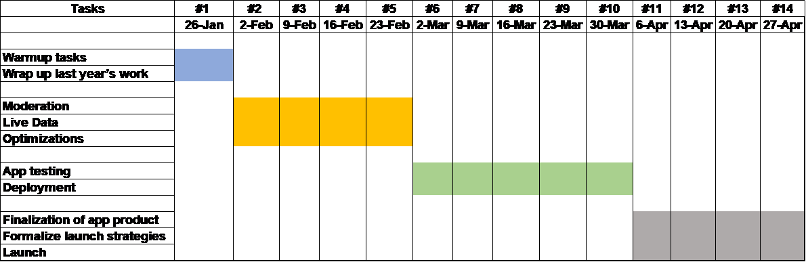

Notes:
Delivery Targets: stories that should be completed by end of sprint
Work-in-Progress: stories that are being worked on during sprint
Backlog: high-level priorities that should be worked on next; in case of developers finishing their work and needing to take on more work, they can understand the next priority

Before each sprint: review the targets for the sprint with the product manager. Evaluate the practicality of the roadmap at hand.

After each sprint: review the work that was completed in the sprint and see if anything requires adjusting.

# Roadmap for  Beakspeak

## Tasks completed as of last year :
1.	Basic authentication
2.	Content creation
a.	Posts
b.	Comments
3.	Feedback
a.	Votes
b.	Reacts
4.	Reactivity
a.	App response – auto updating across the app.

## Overview of to-do’s for this semester:

1.	Warmup tasks + wrap up last year’s tasks
2.	Moderation 
3.	Live data
4.	Optimization
5.	App Testing + Deployment
6.	Finalization of app product
7.	Formalization of app product	
8.	Formalization of launch strategies
9.	Start implementing launch strategies

## Features to be considered for future iterations:
1.	Image support - allow a more expressive media for users
2.	Optimizations
a.	attribute-based collections
i.	Remove boolean admin attribute and create admin collection
ii.	Reduces size of js object
iii.	Reduces complexity of creating collection instance
b.	separate valid posts from reported posts
i.	when a post is reported, remove it from valid collection and move to reported collection
3.	Monetary gain through ads

Time Line 
3
 

## Sprints

### Sprint #1 (1/26)
Delivery Target:
1.	Warm-up Tasks + Wrap Ups
a.	Change comment votes from array to dict
b.	Add comment model and adapt comments to mobx
c.	Streamline authentication using expo auth session
d.	Adapt votes to mobx following reacts example
e.	Add bottom margin to posts so selected react does not touch bottom
f.	Posts/comment validation
g.	Cute error message modal that shows up when app loses connection to backend

Backlog:
(List high-level priorities here)

### Sprint #2 (2/2)
Delivery Target:
1.	Epic : Performance
Stories :
i.	 Posts Loading - Load certain posts at a time 
 			Acceptance Criteria :
a.	Consistently get x posts every time user gets to bottom of the page
b.	Upon refresh only currently loaded posts update
ii.	Refreshing app every 1 minute
Acceptance Criteria
a.	Everyone minute only currently loaded content updates
b.	Only new changes will be reflected, unchanged posts not to be loaded
iii.	Changed list of votes to map of user-vote pairs
Acceptance Criteria
a.	Same functionality on the UI as before

2.	Epic : Authentication 
Stories :
i.	Explore Usage of Expo's Web Browser- elegantly handle redirects to authentication service and back to the app
Acceptance Criteria :
a.	Token is extracted and stored until token no longer authenticates , upon authentication redirect to app
3.	Epic : Mobx Integrations
a.	Stories :
i.	Add comment model and adapt comments to mobx - like posts, model comments to be reactive to state changes via mobx
Acceptance Criteria :
a.	Same functionality on the UI as before change
b.	App will auto update when comments are made

Backlog:
(List high-level priorities here)

### Sprint #3  (2/9) - no Sprint due to Mid-semester break
Delivery Target:
1.	Comments to be integrated with Mobx

2.	Text field for reporting and front end
a.	Batch post retrieval
i.	Check for unnecessary re-renders
Acceptance Criteria :
a.	Upon refresh only currently loaded posts update

ii.	Test for number of renders when retrieving a batch – number of renders in each batch should be equal
Acceptance Criteria :
a.	Consistently get x posts every time user gets to bottom of the page

iii.	Number of post retrievals per user to be fixed – number to be based on ramifications on memory

2.	UI for Reporting Posts 
a.	Reporting  - Allow users a way to report, a single text field pops up when the report button is clicked
Acceptance criteria :
a.	Moderator is able to extract the text from the modal
b.	Moderator is able cancel the report if required

3.	Deploy to play store 
1.	App to be deployed to play store
Acceptance criteria :
a.	App is available to users for download
b.	User is able successfully install the app on their phones

Backlog:
(List high-level priorities here)

### Sprint #4 (2/16)
Delivery Target:
1.	Policy planning - Mathew
i.	Moderation document – User facing document detailing the user policies
   Acceptance criteria :
Document to be shared with Team Lead and other PMs. Team to proofread the document and validate to  all necessary scenarios are included

2.	Experimental setup – Identify population to collect initial user feedback on Beakspeak - Mathew
Acceptance criteria :
a.	Plan to be shared with Team Lead and other PMs. Team to verify the plan and validate it
3.	Wrap up comments - Gai
a.	Acceptance criteria:
i.	New comments show up on main screen and post detail screen without manual refresh
b.	Should be done fairly early in sprint -> move onto adding votes
4.	Combination of votes and comments on post - Gai
a.	Acceptance criteria:
i.	Votes show up on comments and appear like posts
ii.	Same functionality as posts
5.	Debugging batches - continue work from previous sprint - figure out unmounting issue - Yifan + Parker
a.	Acceptance criteria:
Batch post retrieval
1.	Check for unnecessary re-renders
Acceptance Criteria :
b.	Upon refresh only currently loaded posts update

2.	Test for number of renders when retrieving a batch – number of renders in each batch should be equal
Acceptance Criteria :
b.	Consistently get x posts every time user gets to bottom of the page

3.	Number of post retrievals per user to be fixed – number to be based on ramifications on memory
6.	Wrap up reports UI - Franklin + Alice
a.	Change fields to reflect user needs ie. one text field that is titled ‘Why are you reporting this post?”
b.	Should be done fairly early in sprint -> move onto backend
7.	Implement backend pipeline for reporting – start the backend for reporting-Franklin + Alice
a.	Acceptance criteria :
i.	All reports created in the front end to be stored successfully
8.	Implement keychain - Thera
a.	Acceptance criteria:
i.	Token can be retrieved anywhere in app
ii.	Token is retrievable after app closes and reopens
iii.	User doesn’t need to login each time they open the app
9.	Backlog - Replacing authentication token with Thera’s authentication work
Acceptance criteria :
a.	All functionalities to work as before

Backlog:
(List high-level priorities here)

### Sprint #5 (2/23)
Delivery Target:
1.	Report backend – continue the backend for reporting.
Acceptance criteria :
a.	All reports created in the front end to be stored successfully in modal

2.	Miscellaneous activities for finalizing product
Acceptance criteria :
a.	Limit number of  comments on main screen
b.	Sort comments according to votes
c.	Verify android header is at the right position
3.	Combination of votes and comments on post - continue 
Acceptance criteria:
a.	Votes show up on comments and appear like posts
b.	Same functionality as posts
4.	Change decorator syntax to non-decorator syntax 
Acceptance Criteria:
a.	Change the syntax
5.	Adjust app header to status bar - Realign the status bar to appropriate position for the Android version of the App
Acceptance Criteria :
a.	The status bar of the app is properly aligned

### Sprint #6 (3/2)
Delivery Target:
1.	App testing
a.	Simulate system under duress 
Acceptance criteria :
i.	App to function as expected with large number  (X) of users
ii.	App to function as expected with large amount of content (X number of posts)
iii.	 Responsiveness , battery and memory usage to be within acceptable levels

Sprint #7 (3/9)
Delivery Target:
1.	Content creation 
Acceptance Criteria :
a.	Create a mass supply of content for initial reception so users get a sense of the platform's potential when first starting.
2.	Initial Population testing – 
Acceptance Criteria :
a.	App to released to all the  populations identified on experimental setup identified earlier
b.	Feedback to be successfully collected and given to the developers to fix
Backlog:
(List high-level priorities here)

Sprint #8 (3/16)
Delivery Target:
App Testing : 
1.	Continue with testing and collecting feedback
2.	Work to resolve identified issues 

Backlog:
(List high-level priorities here)

Sprint #9 (3/23)
Delivery Target:
App Testing : 
1.	Continue with testing and collecting feedback
2.	Work to resolve identified issues
Backlog:
(List high-level priorities here)

Sprint #10 (3/30)
Delivery Target:
App Testing : 
1.	Continue with testing and collecting feedback
2.	Work to resolve identified issues

Backlog:
(List high-level priorities here)

Sprint #11 (4/06)
Delivery Target:
1.	Finalization of app product
2.	Launch strategies
a.	bot/recruit people to create lots of initial content
3.	Start implementing launch strategies
a.	Code strategies 
b.	Testing with in campus students
c.	Content creation testing
Work-in-Progress:
(List stories that will be in progress here)

Backlog:
(List high-level priorities here)
