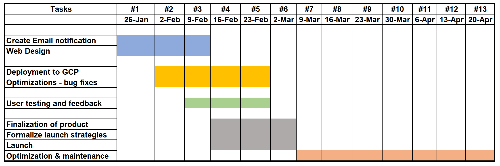

# Carpool 
## Documentation
### Project Name: Carpool
### Team Members: Diksha Gupta, Myra Ramdenbourg, Gerald Wang, Josie Garza, Angela Hwang, Ling Wu, Emmett Bertram

**Onboarding reflection:** 
What did you take away? What was it like joining the team? What do you wish was done better? How could your workflow be improved?
 - The onboarding document was relatively easy to follow. The start to joining the team took a little longer than I would have liked. It would have been easier to have an official launch date and formal introduction and transfer of knowledge. However, once I joined the team, I quickly felt at ease.

**Launch process:** 
How will you intend on getting the product to the customer? What is the goal of the launch?
 - To get the product to the customer, we intend to have it marketed on the facebook page with the assistance of the page administrator. The goal of the launch is to inform the customer base that this is available and how to use it.

**Customer journey:** 
_Front-end:_ What is the user doing on their screen?
 - The user is selecting and creating the rides that they would like to join or create to travel to and from one of the area airports back to Rice. 
 
_Back-end:_ As the user is using your app, what is going on in the back-end?

**Usage policies:**  
What kind of policies does your app have? Moderation, privacy, community guidelines, etc.
 - Currently there is no usage policy in place for the app. Security is embedded through the use of the university NetID to sign into the application. 
 
**Roadmap (current):** What is the most recent roadmap?
 - I have incorporated Epics and stories to the roadmap with target deadlines.
 
**Roadmap (original):** What was the original roadmap? Having the two roadmaps side-by-side should be useful for understanding the delays. After the project, you can discuss what happened to the time lag.
 - The original roadmap was a running To-Do list shared in googledoc, similar to the Wunderlist app. I found it helpful to get an understanding what was done before I was onboarded.
 

## Carpool Roadmap

### GANTT Chart

### **_Sprint #1 (1/26)_**

**Delivery Target:**
1. Edit icons for updated information on telephone numbers

**Work-in-Progress:**
1. Email Notifications add the option to send emails when a rider joins (Angela and Josie)
   - [Story]Sending emails to all riders who are a part of the ride; two separate emails: one for all and one specific to the joiner
     - Acceptance Criteria:
       - Create notification for when someone creates the ride, User is reminded to contact uber
       - Edit the profile page to include ride information
2. Update landing page (Emmett)
   - [Story] Made new branch with new front end revisions; changes on landing page - new color schema and step buttons (needs content) New buttons added to the nav bar (find a ride, etc), changed the search buttons to look cleaner
      - Acceptance Criteria:
        - Next step is to find a cohesive color scheme that can be consistent across all pages; add logo to the landing page and at the top; change padding issue to get rid of dead weight
3. Edit profile icons for telephone numbers (Ling)
   - Icons 
   - Fix edit page
4. Diksha will merge the branches tonight

**Backlog:**
1. Next steps: How to draft the email; Provide better information; instructions
2. Scrum before the user insights; we all check that everything is working

### **_Sprint #2 (2/2)_**

**Delivery Target:**
1. Icon updates Change random images that had been assigned previously to profile pictures or pic from rice system so that Users can personalize (Ling)
2. Develop opt-in option so that users can receive updates on their ride
   - [Story] Include an unsubscribe option in email notifications
3. Email Notifications add the option to send emails when a rider joins (Angela and Josie)
   - Sending emails to all riders who are a part of the ride; two separate emails: one for all and one specific to the joiner
     - Create notification for when someone creates the ride, they remind them to contact uber
     - Edit the profile page to include ride information
   - All ride users will receive an email reminder 24 hours prior to the ride date so that they may prepare for the ride
     - The email will include data of the ride
     - Include link to cancel participation in the ride
   - Ride users will receive an email if the ride is canceled so that riders can reorganize or setup a new ride
     - Email will include link to page to setup a ride(List stories that will be in progress here)

**Work-in-Progress:**
1. Email Notifications add the option to send emails when a rider joins 
   - [Story] Sending emails to all riders who are a part of the ride; two separate emails: one for all and one specific to the joiner
     - Acceptance Criteria:
       - Notification for when someone creates the ride, they remind them to contact uber
       - Profile pages will include ride information
   - [Story] All ride users will receive an email reminder 24 hours prior to the ride date so that they may prepare for the ride
     - Acceptance Criteria:
       - The email will include data of the ride
       - Include link to cancel participation in the ride
   - [Story] Ride users will receive an email if the ride is canceled so that riders can reorganize or setup a new ride
     - Acceptance Criteria:
       - Email will include link to page to setup a ride(List stories that will be in progress here)
2. Front End web design
   - Decide on color theme and apply to pages for consistency
3. Documentation of project progress
   - upload roadmap to Github
   
**Backlog:**
1. N/A

### **_Sprint #3 (2/9)_** - no Sprint due to Mid-semester break

### **_Sprint #4 (2/16)_**

**Delivery Target:**
1. Final web design aesthetic completed for compelling interface
Finalize buttons
2. Get Nicole on board for promoting the new app; removing the existing google sheet and also adding (Diksha, Myra & Katherine
3. Soft launch of site for user testing
4. Connect to GCP
   - debug to connect

**Work in Progress:**
1. The user will have an aesthetically compelling interface so they are more likely to use the service
   - Creating and updating buttons
   - [Story] Standardizing app color theme throughout pages
     - Acceptance Criteria:
       - The logo to the tab bar and add the logo to the top lefthand side of the header
2. Optimize the app for launch
   - [Story] Gain user insights
     - Pull Rice Apps students from other teams to demo the app and interview;
3. Marketing and planning for App Launch
   - Get buy-in from carpool facebook page admin
     - Acceptance Criteria:
       - Written documentation confirming go-ahead from facebook page admin 
   - Find manufacturer for creating the stickers with the app logo
   - Record 'how-to' tutorial on using the website application
   
**Backlog:**

### **_Sprint #5 (2/23)_**

**Delivery Target:**
1. Complete program gaps
2. App Launch
   - Complete 'how-to' tutorial and upload to youtube and website
   - Reserve RMC space for launch

**Work-in-Progress:**
1. Review app usage and outcomes from soft launch
   - Look for any new gaps we had not anticipated
2. Finalize plans for Launch
   - Reserve RMC space

**Backlog:**

### **_Sprint #6 (3/2)_**

**Delivery Target:**
1. Application is ready for usage

**Work-in-Progress:**
1. Systems check to make sure product is ready for launch - checklist

**Backlog:**
1. Planning for Launch

**Milestone:**
# Launch day!! - 3/4

### **_Sprint #7 (3/9)_**

**Delivery Target:**
1. Updated features based on user feedback

**Work-in-Progress:**
1. Review user feedback and update accordingly

**Backlog:**
1. N/A
