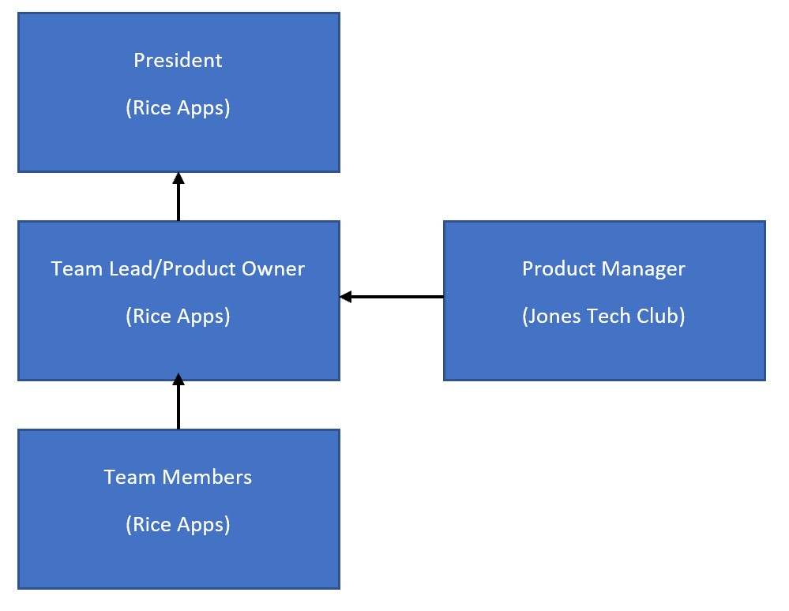

# PM Onboarding Document

The goal of this document is to help current and future Rice Apps PM's onboard efficiently and contribute as soon as possible to the organization. Some of the documentation touches on general product management guidelines, while other parts are written to be Rice Apps specific. 

Rice Apps PM Timeline

## Table of contents
**Rice Apps PM Timeline:**  
1/13: PM Onboarding with Jeffrey and Jason  
Phase 1: Documentation  
Phase 2: Customer interviews  
Phase 3: Roadmap creation and prioritization  
Phase 4: Hypothesis development and testing  
Phase 5: Launch/iteration  

### Introduction to Rice Apps
#### Background:
Rice Apps is a student-run computer science organization that desires to create value to the Rice local community and its student members through 1) the delivery of value-adding apps, and 2) teaching its members how to code (the Computer Science program is highly theoretical in its course structure, so this is their first exposure to coding).

#### Proposed Organization:

#### Rice Apps Work Process:
Rice Apps meets twice a week. Each team determines the day of the week and time that they will meet to conduct their scrum session. Then on Saturdays, they will meet from 1-4pm to code.  
Product managers should work with their teams to determine what times are best for scrums.

#### Jones Tech Club Work Process:
Tech Club PM’s will be expected to join the team during their scrum sessions. It is recommended but not mandatory to join the teams on Saturdays from 1-4pm. During other times, it is important for Tech PM’s to understand their customer and develop their skills or roadmap.

Our structure will continue to change and adjust throughout the semester as we determine best practices and trial ideas. We also hold one weekly PM stand-up with the intention of sharing updates and challenges.

#### Role of Jones Tech Club
During the course of their work in the Fall Semester 2018, Rice Apps has identified a need for those who can be more dedicated in talking to customers and advising their product owners on the direction of the product.

The role of the Jones Tech Club product managers will be to serve as the voice of the customer, ensuring that the product decisions will be to the benefit of the end-user. They will need to play both an advisory and collaborative role with the product owner. They will need to both help the product owner with any issues that may arise and work with the product owner on determining the future of the product.

This imitates the role that product managers will often play in organizations, where they do not have the **power or ownership** but need to create buy-in amongst their stakeholders. As this is a key learning experience for Rice Apps, we also want this to be an educational experience for Tech Club participants to gain valuable hands-on experience about product management in a lower pressure environment.

For any issues, please reach out to the Rice Apps president or Jones Tech Club president. For additional guidance or input, please also ask Dr. Panahi.

### Pre-Semester Preparation

#### Principles of Agile
Agile is a development methodology demonstrating a commitment to iterative workflows. It was originally derived from a meeting of software minds, who came together and set the following principles, in what’s known as the Agile Manifesto:
<http://agilemanifesto.org/>

While we will not be memorizing these principles, you may want to be familiar with them, especially if you want to be agile certified.

Please use this Atlassian page to learn more about Agile:
<https://www.atlassian.com/agile/scrum>

#### How Rice Apps Does Agile
Rice Apps follows a more modified version of Agile to accommodate for the schedules and demands of their students.

As you now know, the Agile process has a few steps - daily standups, sprint retrospectives, sprint planning, etc. The Rice Apps team condenses these into one weekday afternoon/evening, where they’ll meet and perform these activites.
There is no story-pointing. Story-pointing, or the process to understand the level of effort with each story, is not utilized.
All coding happens on Saturdays. This means that the bulk of progress will happen during the three hours each weekend. There are no agile ceremonies that happen, but Saturday will be a great time for you to learn more about the dynamics of the team you’re working with.

#### Documentation
Rice Apps currently has documentation duties assigned to team leads, who unfortunately have not had the time to prepare proper documentation. Part of our problem will be understanding the best practices for how we track the user journey, the technical solutions that have been built, etc.

We will be learning to document on Github, through Docsify.
Please create a Github account and Docsify profile:
<https://github.com/>
<https://docsify.js.org/#/>

Use this Github guide to understand the principles of repositories, branching, commits, and pull requests: <https://guides.github.com/activities/hello-world/>

This page has some additional information about the workflow in Github: <https://guides.github.com/introduction/flow/>

#### Markdown Language
Markdown is the language that we’ll be using in Github. Here’s a cheatsheet of sorts: <https://github.com/adam-p/markdown-here/wiki/Markdown-Cheatsheet>
<https://help.github.com/articles/about-writing-and-formatting-on-github/>

While I haven’t had to use Markdown in my career, adding more skills can only help!

#### MVP - Minimum Viable Product
The MVP is an oft-used term in tech, describing the vision and minimum featureset to a certain set audience. You have a clear vision of the problem you’re solving, but it will be a long time before you’re able to achieve your ideal state. What are the minimum features possible that will make your product work? Anything fancy can be built in later because it’s most important to gather immediate user feedback to understand what features you will need to build and how you will prioritize those features

Goal of MVP: the MVP’s purpose is to collect user feedback immediately. The user feedback and insights you gather from talking to your first users will guide the direction of your product. You will be able to **iterate on features and develop your product roadmap** based on your MVP. For this to succeed, you must be able to gather feedback effectively and properly use that feedback to guide the product.

#### Access to LiuLab
Access to LiuLab
Please read the community guidelines and take the following quiz so that you can access the LiuLab: <http://bit.ly/LilieAccessQuiz>

### Phase 1: Documentation
We will cover five types of documentation, which will be continually updated throughout the course of the semester. Documentation is often the job of the PM, who ensures that the organization will keep records and logs of the different moving parts of the project.

#### Why Documentation?
Educational Benefits:
1) You will gain an instinct for features that should be documented and those that will not be documented. Filter out the unnecessary.
2) You will learn more about the app that you will be managing. After learning the ins and outs of the app, you will be able to more effectively communicate with your customers and with your internal stakeholders.
3) You will learn about Git and a few core principles of the software development workflow

#### Documentation Principles
You will play a key role in determining what documentation will look like for the app that you’re managing. Regardless, there are five broad areas of documentation that you will participate in:
**User journey:** what are the steps of the customer journey? What is the “happy path”, and what is a “un-happy path”?
**Technical journey:** when the user is taking their journey, what is happening behind the scenes?
**Protocols:** what policies do you want to implement for your app?
**Feedback collection:** what user feedback are you collecting? How is that changing over time?
**Roadmap:** what does the next iteration of your app look like?

#### Defining Problems and Experiments:
A vital part in product management is being able to identify customer pain points. What is the customer’s problem? Don’t think about the solutions, and just focus on the issues that your customers or users are having.

There are different methods to identify customer problems, with varying amounts of interaction. 
**1) Talking to customers directly:** customer interviews help you talk directly to your user and find a problem space associated with the issues that they’re facing.
**2) Observing customers:** see how customers are interacting in their natural environment. Notice when they have issues. Talk to them afterwards if you can interface and find more information.
**3) Disseminating through data:** this will not be one we readily have, but in your context, you can do some research on demographics to identify user demographics and populations. 
- use this sheet to identify the weaknesses of your solution or product and what you can do to mitigate the issue
- we will not worry about unfair advantages, costs, or revenue streams
- This is also known as “Lean Canvas”, a way for folks to understand their product better
